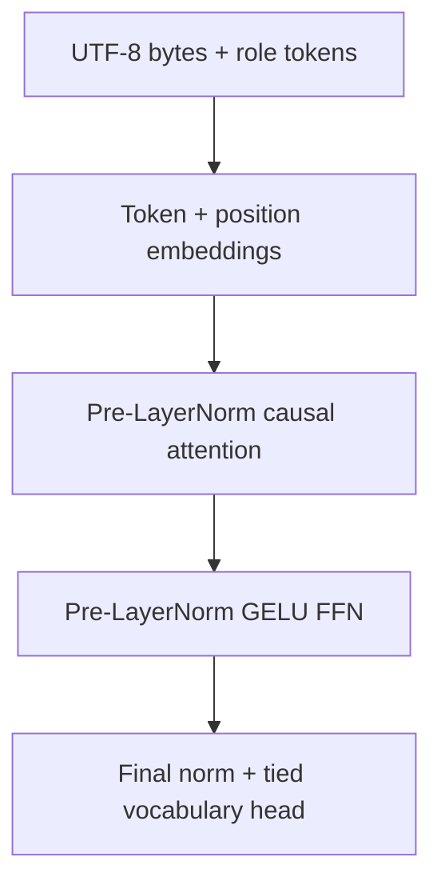

# NativeByteLM-500M 설계·연구 기록

## 결론

이 저장소의 새 기본 경로는 특정 공개 모델의 체크포인트를 변환하거나 외부 모델의 tokenizer·채팅 형식·모델 클래스를 재사용하지 않는 독립 학습 경로로 구성한다. 구현은 PyTorch의 기본 텐서 연산만을 사용하며, 가중치는 매 실행마다 무작위로 초기화된다. 학습 데이터는 모델 가중치와 별개의 입력 자산으로 취급하고, 각 데이터 묶음의 출처와 라이선스를 매니페스트에 기록한다.

이 설계는 “기존 모델의 이름을 바꾼 500M 모델”이 아니다. 모델 품질은 아직 학습 데이터의 규모와 학습량에 의해 결정되며, 이 저장소에 포함된 시드는 기능 검증용이다. 실제로 쓸 수 있는 언어 모델을 만들려면 별도의 대규모 데이터 수집·정제·학습·평가가 필요하다.

## 1. 요구사항과 경계

### 포함하는 것

1. 약 500M개의 학습 파라미터를 가진 decoder-only 언어 모델
2. 한국어·영어·이모지·소스 코드를 다룰 수 있는 자체 UTF-8 바이트 토크나이저
3. 다음 토큰 예측을 위한 사전 학습 루프
4. 대화 입력을 위한 자체 role-token 규약
5. CUDA 기본 실행, CPU 명시 실행, AMP, gradient checkpointing
6. 데이터 검증·중복 제거·분할·해시 기록

### 제외하는 것

1. 외부 체크포인트에서 가중치를 복사하거나 변환하는 과정
2. 외부 tokenizer vocabulary, merges, chat template
3. 외부 모델의 reasoning trace를 정답으로 취급하는 데이터 파이프라인
4. 작은 시드 데이터만으로 사전 학습이 완료되었다는 주장
5. 학습되지 않은 랜덤 가중치 파일의 저장소 배포

학습 데이터가 다른 시스템의 도움으로 작성될 수 있다는 조건은 모델 가중치의 출처와 분리해서 기록한다. 데이터 생성에 도움을 받은 경우에도 생성 프롬프트, 검수 기준, 원문 라이선스, 중복 제거 방법을 남겨야 하며, 데이터가 외부 모델의 내부 가중치를 포함한다는 의미로 해석하지 않는다.

## 2. 아키텍처

### 파라미터 구성

| 구성요소 | 계산 | 파라미터 수 |
|---|---:|---:|
| 토큰 임베딩 | 264 × 1,280 | 337,920 |
| 위치 임베딩 | 2,048 × 1,280 | 2,621,440 |
| 블록당 QKV·출력 투영 | 4 × 1,280 × 1,280 | 6,553,600 |
| 블록당 FFN | 2 × 1,280 × 5,504 | 14,090,240 |
| 블록당 LayerNorm | 2 × 2 × 1,280 | 5,120 |
| 디코더 블록 | 위 블록 × 24 | 495,575,040 |
| 최종 LayerNorm | 2 × 1,280 | 2,560 |
| 합계 | tied output head 포함 | **498,536,960** |

출력 projection은 입력 임베딩과 weight tying을 사용하므로 별도의 264 × 1,280 행렬을 추가하지 않는다. 계산값은 `estimate_parameter_count()`가 반환하는 값이며 실제 모델의 `state_dict` 파라미터 수를 테스트할 때도 같은 범위를 확인한다.

### 순전파 흐름

Transformer는 순환이나 합성곱 없이 attention으로 시퀀스를 처리할 수 있다는 원래 논문의 구조를 바탕으로 한다.^1 이 사실은 특정 상용 모델의 구현을 가져왔다는 뜻이 아니라, 공개된 기본 신경망 연구를 독립 코드로 재구현했다는 뜻이다.

각 attention 블록은 Q, K, V를 하나의 투영에서 나누고 20개 head로 분리한다. 미래 위치를 보지 못하도록 lower-triangular causal mask를 사용한다. PyTorch의 `scaled_dot_product_attention`이 제공되는 환경에서는 `is_causal=True`로 호출해 구현 선택에 맞는 최적화 경로를 사용하고, 구버전에서는 동일한 수학적 mask를 직접 계산한다.^2

최근 경량 언어 모델에서 흔히 연상되는 회전 위치 인코딩이나 grouped-query attention은 이 설계의 필수 구성요소로 사용하지 않는다. 위치 정보는 학습형 절대 임베딩으로, key/value projection은 모든 attention head에 대해 독립적으로 계산한다. 이 선택은 가장 최신 구조를 따라가는 것보다 의존성·검증 범위를 줄이고 구현의 출처를 명확하게 하기 위한 것이다.

### 활성화와 정규화

각 블록은 Pre-LayerNorm residual 구조를 사용한다. FFN에는 GELU의 tanh 근사를 사용한다. GELU는 입력값을 단순한 부호로 자르는 대신 정규분포 누적분포에 따라 부드럽게 가중하는 활성화로 제안되었다.^3

LayerNorm, learned absolute positions, full multi-head attention은 단순하고 검증 가능한 구성이다. 이 선택은 품질을 보장하는 마법의 조합이 아니다. 작은 데이터나 부족한 token budget에서는 구조보다 데이터와 학습량이 성능을 더 크게 좌우할 수 있다.

## 3. 토크나이저 설계

### UTF-8 바이트 단위

토크나이저는 텍스트를 NFKC로 정규화한 뒤 UTF-8 바이트로 바꾼다. UTF-8은 UCS/Unicode 문자를 1~4개의 octet으로 표현하는 표준 형식이다.^4 따라서 고정된 언어별 vocabulary에 없는 문자도 `<unk>`로 손실하지 않고 바이트열로 보존할 수 있다.

특수 토큰은 다음과 같다.

| ID | 토큰 | 목적 |
|---:|---|---|
| 0 | `<|pad|>` | padding 예약 |
| 1 | `<|bos|>` | 시퀀스 시작 |
| 2 | `<|eos|>` | 시퀀스 종료 |
| 3 | `<|unk|>` | 예약된 미지 토큰 |
| 4 | `<|system|>` | 시스템 메시지 시작 |
| 5 | `<|user|>` | 사용자 메시지 시작 |
| 6 | `<|assistant|>` | 모델 메시지 시작 |
| 7 | `<|turn_end|>` | 메시지 경계 |
| 8~263 | UTF-8 byte 0~255 | 원문 바이트 |

대화 형식은 별도 Jinja 템플릿이 아니라 위 role token을 순서대로 붙이는 자체 프로토콜이다. 생성 시에는 system과 user 메시지를 encode한 뒤 assistant token을 마지막에 추가하고, 모델이 `<|eos|>`를 생성하면 종료한다.

### 장점과 비용

장점은 재현성, 언어 범위, 외부 vocabulary 라이선스 제거다. 비용은 한글과 한자처럼 여러 바이트로 표현되는 문자의 시퀀스 길이가 늘어난다는 점이다. 실제 장문 학습에서는 BPE나 unigram tokenizer를 독립적으로 학습하는 변형을 실험할 수 있지만, 그 경우 vocabulary 학습 데이터와 tokenizer artifact의 출처를 별도로 검증해야 한다. 현재 구현은 그 복잡성을 추가하지 않고 모델·데이터의 독립성을 먼저 확보한다.

## 4. 학습 전략

### 목적함수

각 블록의 입력 `x[0:n]`으로 다음 토큰 `x[1:n+1]`을 예측하는 causal cross-entropy를 사용한다. 패딩을 사용하지 않는 packed stream을 만들어 GPU의 빈 영역을 줄이고, 문서 사이에는 EOS를 넣어 경계를 표시한다.

### 옵티마이저와 스케줄

기본값은 AdamW, β=(0.9, 0.95), weight decay=0.1이다. Adam과 weight decay를 gradient update에서 분리하는 AdamW의 동기는 adaptive optimizer에서 L2 regularization과 weight decay가 같지 않다는 관찰에 기반한다.^5 학습률은 warmup 뒤 cosine으로 낮춘다. 이는 초기 업데이트를 완만하게 시작하고 후반의 변화 폭을 줄이기 위한 실용적인 기본값이지, 데이터에 대한 최적값이라는 주장은 아니다.

### 메모리

498,536,960개의 파라미터는 대략 다음 정도의 원시 저장 공간을 가진다.

| 표현 | 가중치만 대략 |
|---|---:|
| float32 | 약 1.86 GiB |
| float16/bfloat16 | 약 0.93 GiB |
| AdamW 1·2차 moment를 float32로 저장 | 추가 약 3.71 GiB |

여기에 gradient와 attention/FFN activation이 추가된다. 2,048 토큰 문맥은 attention의 시퀀스 비용도 크기 때문에, 시작 설정은 batch 1, gradient accumulation 8, AMP, gradient checkpointing으로 둔다. PyTorch의 AMP는 autocast와 GradScaler 조합을 제공하며, float16에서는 underflow를 보완하기 위해 scaler를 활성화한다.^6 Gradient checkpointing은 순전파 중 저장할 activation을 줄이는 대신 역전파에서 일부 구간을 다시 계산하는 방식이다.^7 실제 필요한 VRAM은 PyTorch 버전, GPU, 커널, batch, sequence length에 따라 달라지므로 반드시 smoke run 뒤에 측정한다.

### 권장 순서

1. `generate_native_data.py`로 자체 시드 생성
2. `prepare_native_sft.py`로 구조와 중복 검사
3. `python -m unittest -v test_native_500m.py` 실행
4. `--preset smoke --max-steps 10`으로 end-to-end 점검
5. 실제 학습 데이터의 출처·라이선스·해시 확인
6. CUDA에서 짧은 warmup run을 수행하고 VRAM·tokens/s·loss를 기록
7. 충분한 token budget으로 사전 학습
8. 고정된 validation split에서 loss와 perplexity를 기록
9. 대화형 SFT를 별도 단계로 수행하고 일반 언어 능력의 회귀를 평가

## 5. 데이터 제작 정책

저장소의 자체 시드는 설명문, 디버깅, 계획, 글쓰기, 안전, 수학 등 작은 주제를 균형 있게 포함한다. 각 SFT 레코드는 `source=self_authored_seed`, `license=self-authored`를 기록한다. 이 시드는 실행 경로가 깨지지 않았는지 확인하기 위한 것이며, 500M 사전 학습에 충분한 데이터셋이 아니다.

추가 데이터는 다음 조건을 충족해야 한다.

- 원문 URL 또는 생성 방법을 기록한다.
- 라이선스와 사용 범위를 확인한다.
- 언어·문서 유형·중복률·평균 길이를 기록한다.
- 개인 정보, 비밀값, 악성 실행 지시, 깨진 인코딩을 제거한다.
- train/validation이 같은 문서나 거의 같은 문장을 공유하지 않게 한다.
- 모델 출력으로 만든 데이터는 synthetic source라고 표시하고 사람이 검수한다.
- 출처가 불명확한 모델 응답을 사실 데이터로 승격하지 않는다.

`prepare_native_sft.py`는 현재 JSONL의 message 구조, 역할 순서, 빈 내용, 중복을 검증한다. 나중에 외부 데이터를 추가할 때도 같은 매니페스트 형식을 사용하면, 모델 가중치와 데이터 변경을 분리해서 재현할 수 있다.

## 6. 검증 기준

현재 자동 테스트는 다음을 확인한다.

1. 한국어와 이모지가 byte round-trip되는지
2. 자체 role-token protocol이 예상 순서를 만드는지
3. 기본 설정이 490M~510M 범위에 있는지
4. smoke 모델이 logits와 causal loss를 계산하는지
5. 뒤쪽 토큰을 바꿔도 앞쪽 위치의 logits가 바뀌지 않는지
6. deterministic generation이 batch 차원과 길이를 보존하는지

추가로 실제 학습에서는 다음을 기록해야 한다.

- global step, effective tokens, learning rate
- train/validation loss와 perplexity
- gradient norm, overflow 횟수, checkpoint 해시
- 데이터 매니페스트 해시
- GPU 종류, PyTorch 버전, CUDA 버전, seed

### 현재 한계

- KV cache를 구현하지 않아 긴 생성은 매 토큰마다 문맥을 다시 계산한다.
- byte tokenizer로 인해 한국어 효율이 낮을 수 있다.
- 현재 학습 루프는 일반 causal LM을 우선하며, assistant-only label mask는 후속 개선 항목이다.
- 자체 시드는 모델의 일반 지식이나 안전성을 보장하지 않는다.
- 실제 500M 가중치는 학습 환경에서 생성해야 하며 저장소에 포함하지 않는다.

## 7. 출처

1. Vaswani et al., “Attention Is All You Need,” 2017. [arXiv](https://arxiv.org/abs/1706.03762)
2. PyTorch, `torch.nn.functional.scaled_dot_product_attention` documentation. [Official documentation](https://docs.pytorch.org/docs/stable/generated/torch.nn.functional.scaled_dot_product_attention.html)
3. Hendrycks and Gimpel, “Gaussian Error Linear Units (GELUs),” 2016. [arXiv](https://arxiv.org/abs/1606.08415)
4. Yergeau, “RFC 3629: UTF-8, a transformation format of ISO 10646,” IETF. [RFC Editor](https://www.rfc-editor.org/info/rfc3629)
5. Loshchilov and Hutter, “Decoupled Weight Decay Regularization,” 2017. [arXiv](https://arxiv.org/abs/1711.05101)
6. PyTorch, “Automatic Mixed Precision package — torch.amp.” [Official documentation](https://docs.pytorch.org/docs/stable/amp.html)
7. PyTorch, “torch.utils.checkpoint.” [Official documentation](https://docs.pytorch.org/docs/stable/checkpoint.html)
